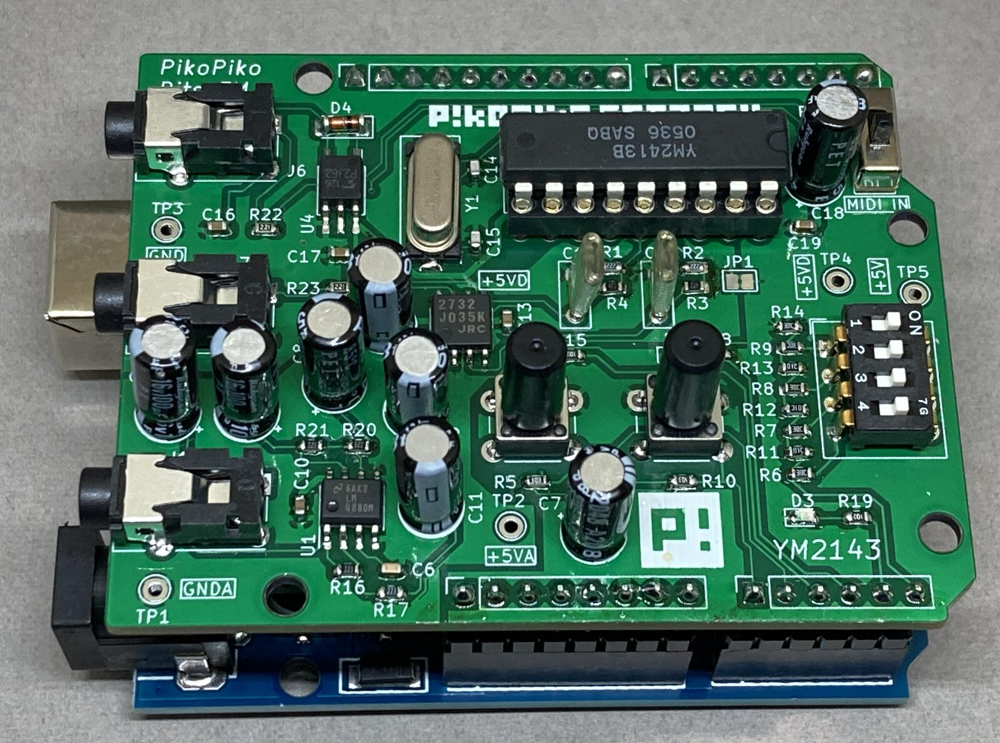

# PikoPikoBits FM
- YM2413 FM Synthesizer Shield for Arduino
- Piko Piko Bits FM は Arduino用 FM音源シールド です。
- FM音源 YM2413、MIDI in/out搭載。ArduinoがFM音源シンセになります。

## ハードウェア
- Arduno用シールドです。IOはほぼ使い切っています。
- 電源はUSB給電でも動作しますがノイズが乗りますので、ArduinoのDC電源ジャックに給電して使用することをおすすめします。
- MIDI in/outはTRS規格です。
- オーディオ出力はパワーアンプを使用しています。ヘッドフォンは小型のスピーカを直結できます。スピーカーの場合は音が小さいので動作確認用程度に持っていただければと思います。回路図ではLM4880と記載ありますが、LM4880またはLM4881を使用しています。
- SW4はMIDI inをRXから切り離します。つながったままですと、UARTと干渉して、プログラムが正常に書き込めないので、PROG側にしてください。演奏時はMIDI側にしてください。
- 拡張用に、LED×3、プッシュSWx2、4bit DIP-SWを搭載しています。プログラム次第で自由にお使いいただけます。サンプルコードでの機能は以下のサンプルコードの所で解説します。

##改修箇所
- DIP-SWとGND間に抵抗(1KΩ)を入れています（基板裏面に実装）。DIP-SWは抵抗ラダーDACとして動作し、その値をアナログピンで読み取ることにより、4bitの値を計算しますが、0の場合はOPENなってしまいました。その為ラダーに使っている抵抗（10kΩ、20kΩ)より一桁低い値でプルダウンしています。線形性は若干悪くなりますが、16のレベル差がわかればいいので問題あります。次の基板改変時に修正予定です。

## ソフトウェア
- Arduino IDEベースです。
- MIDIライブラリが必要です。MIDIライブラリは多種リリースされていますが、https://github.com/FortySevenEffects/arduino_midi_library を使用しています。
## サンプルコード
- Arduino UNO用です。
- MIDI入力されたMIDI信号に合わせて演奏します。MIDIチャンネルは1-16chのすべてのチャンネルを受信します。YM2413のメロディ音9音、またはメロディ音6音、リズム5音モード（DIP-SWで変更可能）で動きます。先着最大発音（6または9）数まで発音し、note offメッセージを受信して、空きができたら、次に来たnote on信号を発音します。試してみるとわかりますが、普通のGM音源用のデータを食わせてもそれなりに聞けてしまいます。（もちろん変なところはありますが）
- メロディ音6音、リズム5音モードの時は、チェンネル10で送られて来たリズムデータをGMっぽいマップで発音します。リズムは5音しかないので、これ以外のノート番号を受信した場合はそれっぽい、音に割り付けます。
- 内蔵音色はGMっぽい配列にしています。これはDIP-SWで切り替え可能です。
- https://github.com/htlabnet/YM2413_Shield_For_v1/tree/master/Firmware/YM2413_Tetris を参考にさせていただきました。ありがとうございます。
- DIP-SWの状態は起動時(setup()）のみ読み込みます。変更した場合はリセットしてください。
##### スイッチの機能
- DIP-SW bit0 トーンマップ切替。0：GMっぽい配列  1:内蔵音色1-15の繰り返し
- DIP-SW bit1 リズムON/OFF     0：メロディ音9音　1:メロディ音6音、リズム5音
- DIP-SW bit2 未使用
- DIP-SW bit3 未使用

- SW2：MIDIパニック。note onのままで、note offが来ないとき（演奏中にMIDIケーブルを引き抜いてしまった等）、発音しっぱなしになりますが、このスイッチを押すと、すべての発音停止します。
- SW3 : 未使用
##### LEDの機能
- LED1：メロディ発音時に点灯します。
- LED2：リズム発音時に点灯します。
- LED3：未使用

